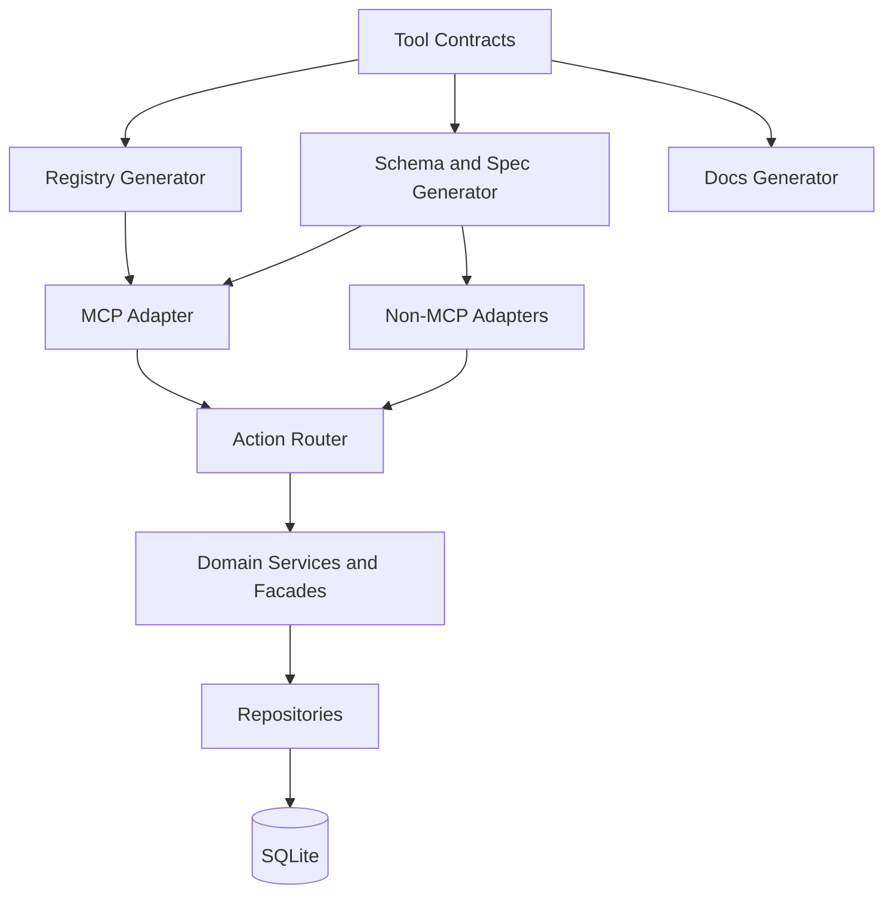

## ADR-005: Unified Ownership Architecture (Contract-First Multi-Adapter)

### Status
Proposed

### Date
2026-02-08

### Context
ADR-001 through ADR-004 identify structural risks that block a durable unified tool surface for LLM runtimes:
- Contract drift between metadata, schema, and handlers
- Module-scoped mutable request context
- Transport-layer handlers coupled directly to persistence
- Dual tool surfaces (consolidated and legacy) without explicit long-term policy

The project already has a strong base: consolidated action-based tools, strict schemas, and meta-tools (`search_tools`, `load_tool_schema`). The remaining gap is ownership-level architecture that treats MCP as one adapter, not the core model.

### Decision
Adopt a contract-first platform architecture with clear boundaries and generated adapters.

1. Tool contracts are the single source of truth
- Each tool defines one contract object: metadata, action literals, schemas, handler binding, examples, and compatibility aliases.
- Registry, discovery metadata, documentation snippets, and runtime adapter specs are generated from contracts.

2. Multi-adapter tool delivery
- MCP remains a first-class adapter.
- Additional adapter outputs are generated for non-MCP runtimes (for example OpenAI-compatible function specs) from the same contracts.
- No adapter may define tool schemas independently.

3. Explicit request-scoped context
- Session/request context must be injected through function signatures.
- Module-scoped mutable context holders are disallowed.

4. Handler to domain facade boundary
- Transport handlers may orchestrate I/O only.
- Domain services/facades own business use-cases.
- Repositories/storage own persistence details and DB lifecycle.

5. Legacy surface policy
- Legacy tool surface enters compatibility mode immediately.
- Compatibility mode forwards to consolidated contract-backed handlers.
- Legacy endpoints are removed after the defined deprecation window.

6. Planner-friendly capability graph
- Contracts include planner metadata: prerequisites, recommended next actions, and canonical workflows.
- Meta-tools expose this metadata for LLM planning.

### Target Architecture

### Consequences
Positive:
- Eliminates schema and metadata drift by construction
- Enables one domain core across multiple LLM transports
- Improves concurrency safety and test isolation
- Lowers long-term maintenance cost versus dual surfaces

Trade-offs:
- Requires phased migration and generator tooling
- Short-term complexity while compatibility mode is active
- Additional contract rigor needed for every new tool/action

### Acceptance Criteria
- [ ] Every consolidated tool exports one contract object containing metadata, actions, schemas, and handler bindings
- [ ] `search_tools` and `load_tool_schema` are fully generated from contracts
- [ ] No module-level mutable session context remains in consolidated tool modules
- [ ] Consolidated handlers call domain services/facades instead of `getDb()` directly
- [ ] Legacy surface runs in compatibility mode only and forwards to consolidated contracts
- [ ] Deprecation timeline for legacy surface is documented and published
- [ ] Contract parity tests validate generated metadata/action/schema/handler consistency
- [ ] Planner metadata is available through meta-tools for workflow guidance

### Related ADRs
- ADR-001: Unified Tool Contract Object Model
- ADR-002: Explicit Session Context Injection
- ADR-003: Domain Service/Facade Boundary
- ADR-004: Legacy Tool Surface Strategy

### Source
- `docs/ARCHITECTURE-CODEBASE-ANALYSIS.md`
- `docs/issue-13-adr-001.md`
- `docs/issue-14-adr-002.md`
- `docs/issue-15-adr-003.md`
- `docs/issue-16-adr-004.md`
