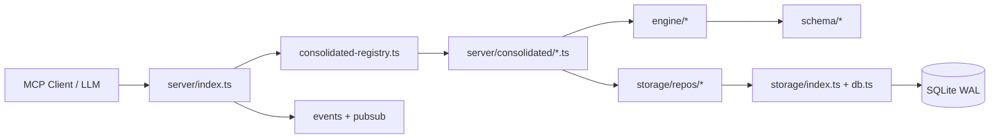
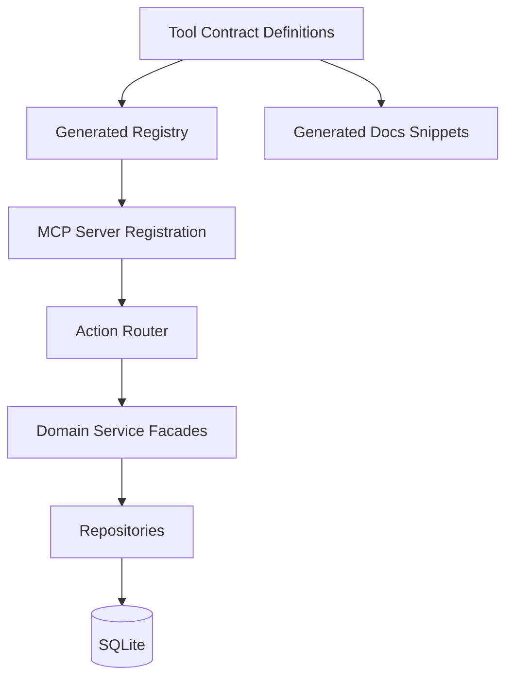

# Codebase Architecture Analysis

## 1) Scope and Method

This analysis covers repository structure, runtime entrypoints, test/build topology, domain contracts, and coupling risks for [`mnehmos.rpg.mcp`](README.md).

Primary artifacts inspected:

- [`package.json`](package.json)
- [`tsconfig.json`](tsconfig.json)
- [`vitest.config.ts`](vitest.config.ts)
- [`src/index.ts`](src/index.ts)
- [`src/run.ts`](src/run.ts)
- [`src/server/index.ts`](src/server/index.ts)
- [`src/server/consolidated-registry.ts`](src/server/consolidated-registry.ts)
- [`src/server/consolidated/index.ts`](src/server/consolidated/index.ts)
- [`src/server/tools.ts`](src/server/tools.ts)
- [`src/storage/index.ts`](src/storage/index.ts)
- [`src/storage/db.ts`](src/storage/db.ts)

## 2) Quantitative Shape (High-Level)

From repository scan:

- TypeScript files: 299
- Source TS files under `src/`: 170
- Test TS files under `tests/`: 127

Source distribution (top-level under `src/`):

- `server`: 46
- `engine`: 38
- `storage`: 31
- `schema`: 29
- `data`: 11
- `math`: 8
- `utils`: 4
- singletons: `index.ts`, `run.ts`, `services`

Interpretation: this is a **server- and engine-heavy simulation kernel** with substantial persistence and schema surface area.

## 3) Architectural Topology

### Key control-plane path

1. Boot and transport selection in [`main()`](src/server/index.ts:75)
2. Tool registry build in [`buildConsolidatedRegistry()`](src/server/consolidated-registry.ts:141)
3. Tool handler registration loop in [`for (const [toolName, entry]...)`](src/server/index.ts:119)
4. Action-level routing in consolidated tools via [`createActionRouter()`](src/server/consolidated/combat-manage.ts:10)

## 4) Runtime and Entry Contract Analysis

### Entrypoints

- Package root entry is [`dist/index.js`](package.json:5), which starts server via side-effect import in [`import './server/index.js'`](src/index.ts:7).
- Alternate runner duplicates startup in [`import './server/index.js'`](src/run.ts:1).

**Assessment:** dual entrypoint pattern is simple but slightly redundant. Side-effect startup is operationally fine, but less explicit for embedding/library use.

### Transport strategy

Runtime chooses among stdio/tcp/unix/websocket in switch logic beginning at [`transportType`](src/server/index.ts:153).

**Strength:** deployment flexibility.

**Risk:** argument parsing is manual; malformed flags may bypass validation.

### Lifecycle correctness

Shutdown hooks are centralized in [`setupShutdownHandlers()`](src/server/index.ts:30), and persistence is closed via [`closeDb()`](src/storage/index.ts:130).

**Strength:** crash-path resilience is explicitly designed.

## 5) Build/Test and Type System Contracts

### Build/Run contracts

- Compile path: [`"build": "tsc"`](package.json:12)
- Runtime path: [`"start": "node dist/server/index.js"`](package.json:13)
- Dev path: [`"dev": "ts-node src/index.ts"`](package.json:15)

### Type discipline

Compiler strictness is high (`strict`, `noUnusedLocals`, `noImplicitReturns`) in [`compilerOptions`](tsconfig.json:2).

**Strength:** strong static guardrails.

### Test contracts

Vitest is configured for parallel file execution and fork isolation at [`poolOptions.forks.isolate`](vitest.config.ts:14).

**Strength:** supports broad integration coverage.

**Risk:** DB global singleton may create hidden coupling under concurrency unless tests enforce isolation paths consistently.

## 6) Domain Layer Analysis

## 6.1 Server Layer

The server acts as orchestration + policy boundary:

- MCP registration and auditing: [`AuditLogger.wrapHandler()`](src/server/index.ts:101)
- Meta-tool discovery: [`MetaTools.SEARCH_TOOLS`](src/server/index.ts:98)
- Consolidation strategy: [`ConsolidatedTools`](src/server/consolidated/index.ts:84)

### Positive architecture properties

- Tool reduction pattern (action-based) lowers protocol complexity.
- Central metadata maps provide discoverability and uniform categorization.

### Concern

`registry` metadata and action schemas are distributed across many files; drift risk exists between:

- category/keyword/capability maps in [`TOOL_CATEGORIES`](src/server/consolidated-registry.ts:40)
- individual action literals (e.g., [`ACTIONS`](src/server/consolidated/combat-manage.ts:30))

## 6.2 Engine Layer

Engine is broad and domain-rich (combat, spatial, worldgen, magic, strategy, DSL).

**Strength:** behavior appears decomposed by subdomain folders.

**Risk:** cross-domain invariants (e.g., combat + spatial + auras + concentration) rely on tool handlers to orchestrate correctly; a formal invariant contract catalog is not yet explicit.

## 6.3 Storage Layer

Storage bootstrap is centralized with singleton semantics in [`getDb()`](src/storage/index.ts:112).

### Strengths

- WAL + foreign keys set in [`initDB()`](src/storage/db.ts:65)
- integrity checks via [`checkDatabaseIntegrity()`](src/storage/db.ts:12)
- platform-aware app data location in [`getAppDataDir()`](src/storage/index.ts:17)

### Risks

- Singleton DB instance with optional caller path can be surprising in multi-context tests/services.
- Corruption recovery deletes DB/WAL/SHM in [`handleCorruptedDatabase()`](src/storage/db.ts:35): practical, but destructive without backup tier.

## 6.4 Schema and Math Contracts

`schema` and `math` are separated as reusable foundational layers.

**Strength:** clear place for deterministic contracts and explicit validation.

**Gap:** no explicit “contract version manifest” ties tool action schemas to schema module versions.

## 7) Legacy vs Consolidated Surface

The repository still contains legacy-style tool module [`src/server/tools.ts`](src/server/tools.ts) while consolidated runtime path uses registry from [`buildConsolidatedRegistry()`](src/server/consolidated-registry.ts:141).

**Architectural interpretation:** migration in progress or retained compatibility layer.

**Risk:** duplicated business logic and divergence in behavior/documentation.

## 8) Coupling and Cohesion Assessment

### Cohesion (Good)

- Foldered domain boundaries under `engine`, `storage/repos`, and `server/consolidated` are mostly coherent.
- Action routers provide local cohesion per tool domain.

### Coupling (Moderate/High hotspots)

1. **Server ↔ Storage runtime coupling**
   - direct `getDb(...)` usage in handlers (example: [`combat-manage` history action](src/server/consolidated/combat-manage.ts:302)).
2. **Registry metadata ↔ Tool definition drift**
   - independent static maps in [`consolidated-registry`](src/server/consolidated-registry.ts:40).
3. **Session context propagation model**
   - mutable context holder in tool modules (example: [`currentContext`](src/server/consolidated/combat-manage.ts:128)).

## 9) Risk Register

1. **Contract drift risk (High)**
   - Between action enums/schemas/metadata/docs.
2. **State management risk in tests (Medium-High)**
   - Singleton DB + parallel test execution can produce brittle behavior if fixtures leak.
3. **Legacy duplication risk (Medium)**
   - Parallel old/new tool stacks increase maintenance cost.
4. **Destructive recovery risk (Medium)**
   - Corruption handler favors availability over data preservation.

## 10) Recommended Architecture Roadmap (Prioritized)

### P0 — Contract Unification

Define a **single source of truth** artifact per consolidated tool containing:

- tool metadata
- action enum
- action schemas
- handler binding

Then generate registry metadata dynamically from those definitions, replacing manual maps in [`consolidated-registry`](src/server/consolidated-registry.ts:40).

### P0 — Session/Context Contract Hardening

Remove mutable module-level context holders and enforce explicit context threading through router function signatures (replace patterns like [`currentContext`](src/server/consolidated/combat-manage.ts:128)).

### P1 — Storage Access Boundary

Introduce service/repository facade interfaces per domain so server handlers avoid direct DB acquisition (reduce direct calls like [`getDb()`](src/storage/index.ts:112)).

### P1 — Legacy Surface Decision

Decide and document one of:

- fully deprecate [`src/server/tools.ts`](src/server/tools.ts)
- or mark it as compatibility mode with tests proving parity

### P2 — Data Durability Profile

Add backup/snapshot before destructive corruption cleanup in [`handleCorruptedDatabase()`](src/storage/db.ts:35).

## 11) ADR Proposals

### ADR-001: Unified Tool Contract Object Model

**Status:** Proposed

Adopt a single declarative contract per consolidated tool (metadata + actions + schema + handler map), from which:

- MCP registration schema is derived
- search/discovery metadata is derived
- documentation snippets are generated

### ADR-002: Explicit Context Injection

**Status:** Proposed

Ban module-scoped mutable context and require context as parameterized dependency to router/handlers.

### ADR-003: Storage Facade Layer

**Status:** Proposed

Introduce a domain facade between server tool handlers and repositories to reduce transport-level dependency on persistence lifecycle.

## 12) Target Reference Architecture (Next Iteration)

## 13) Final Assessment

This codebase is **substantially mature** for an MCP simulation backend: strict typing, broad tests, transport flexibility, and strong domain decomposition are evident. The principal architectural work remaining is **contract centralization and coupling reduction**, not fundamental redesign.

If the P0/P1 recommendations are implemented, this repository should move from “feature-rich and scalable by effort” to “feature-rich and systematically evolvable.”
