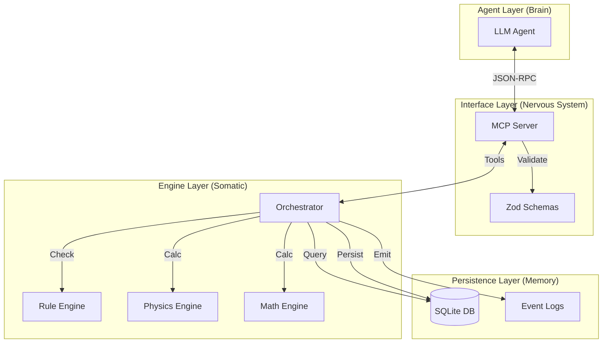

# RPG-MCP: Event-Driven Agentic AI Architecture
**Infrastructure for Embodied AI Reasoning**

**Date:** November 2025  
**Version:** 1.0  
**Repository:** [github.com/Mnehmos/rpg-mcp](https://github.com/Mnehmos/rpg-mcp)

---

## 1. Abstract

As Large Language Models (LLMs) evolve from text processors to agentic decision-makers, they face a critical "grounding problem." Current agents operate in abstract text loops without true embodiment, leading to hallucinations, impossible actions, and a lack of spatial reasoning. **RPG-MCP** proposes a solution: a deterministic, schema-driven "world kernel" that provides a simulated physical reality for agents. By separating **Intent** (LLM) from **Execution** (Engine) via the Model Context Protocol (MCP), we create a robust architecture where agents can observe, orient, decide, and act within strict physical constraints. This paper details the theoretical foundations, system architecture, and implementation of RPG-MCP as a standard infrastructure for embodied AI research and simulation.

---

## 2. Introduction: The Embodiment Problem

Current AI agents largely operate in a void. They generate code, write text, or call APIs, but they lack a coherent "self" or "environment."
- **No Spatial Awareness:** Agents don't know where they are relative to other entities.
- **No Physics:** Agents can "walk through walls" or "teleport" because no system enforces constraints.
- **No Consequence:** State changes are often ephemeral or unstructured.

To achieve Artificial General Intelligence (AGI) or even robust Task-Specific Agents, models need **embodiment**—not necessarily in robotics, but in a simulated environment that enforces rules, causality, and object permanence.

---

## 3. Theoretical Foundation

RPG-MCP is built on the biological analogy of the **Nervous System**.

### 3.1 The Biological Mapping

| Biological Component | RPG-MCP Equivalent | Function |
|----------------------|--------------------|----------|
| **Brain** | LLM (Claude, GPT-4) | High-level reasoning, planning, strategy. |
| **Nervous System** | MCP Server | Transmits signals, formats data, routes inputs/outputs. |
| **Reflex Arc** | Constraint Validator | Rejects impossible actions immediately (e.g., "Wall blocking path"). |
| **Muscles** | Action Tools | Executes validated state changes (`move`, `attack`). |
| **Senses** | Observation Tools | Returns filtered state (`getObservation`). |
| **Physical World** | SQLite Database | Deterministic, persistent state storage. |

### 3.2 The OODA Loop

The system enforces a strict **Observe-Orient-Decide-Act** loop:
1.  **Observe:** Agent calls `getObservation()` to perceive its surroundings.
2.  **Orient:** Agent analyzes the data (LLM reasoning).
3.  **Decide:** Agent formulates a plan.
4.  **Act:** Agent calls `proposeAction()`.
5.  **Validate (Engine):** The engine checks physics/rules.
    *   *Success:* State updates, event emitted.
    *   *Failure:* Rejection reason returned (Feedback Loop).

### 3.3 Intent vs. Execution

A core principle is **"LLMs propose, Engines execute."**
An agent cannot directly write `x=10`. It must submit an intent `MOVE_TO(10)`. The engine calculates pathfinding, movement costs, and collisions. If valid, the engine updates `x`. This prevents "god-mode" hallucinations.

---

## 4. System Architecture



---

## 5. Core Systems

### 5.1 World Generation
Procedural generation using Perlin noise and cellular automata to create terrain, biomes, and river systems.
- **Biomes:** Forest, Desert, Mountain, Swamp, etc.
- **Features:** Rivers, structures, resources.
- **Determinism:** Seed-based generation ensures the same world is created every time.

### 5.2 Combat Engine
A turn-based, stat-driven combat system inspired by TTRPG mechanics.
- **Mechanics:** Attack rolls, Armor Class (AC), Hit Points (HP), Critical Hits.
- **Balance:** Encounter difficulty calculation (CR vs Party Level).
- **State:** Tracks initiative, status effects, and cooldowns.

### 5.3 Spatial Reasoning
Manages entity positioning and movement in 3D space.
- **Pathfinding:** A* or Dijkstra algorithms for navigation.
- **Line of Sight:** Raycasting to determine visibility.
- **Collision:** Prevents entities from occupying the same space or passing through obstacles.

### 5.4 Inventory System
Manages items, equipment, and resources.
- **Containers:** Inventory slots, weight limits.
- **Equipment:** Slots (Main Hand, Off Hand, Armor) with stat bonuses.
- **Usage:** Consumables (potions), tools, weapons.

### 5.5 Quest System
Tracks high-level goals and progression.
- **Structure:** Objectives, prerequisites, rewards.
- **State:** Active, Completed, Failed.
- **Integration:** Completion triggers inventory rewards or world state changes.

### 5.6 Math Engine
A dedicated subsystem for complex calculations, ensuring LLMs don't do math.
- **Components:** Dice, Probability, Algebra, Physics, Calculus.
- **Features:** Seeded RNG, symbolic solving, projectile motion.
- **Audit:** Full calculation history and step-by-step explanations.

---

## 6. MCP Tool Reference

The system exposes its capabilities via Model Context Protocol tools:

| Category | Tool | Description |
|----------|------|-------------|
| **Observation** | `get_observation` | See local entities and terrain. |
| | `query_entities` | Find specific entities by criteria. |
| **Action** | `propose_action` | Move, attack, interact (generic intent). |
| **World** | `create_world` | Generate a new world seed. |
| | `world_step` | Advance time/physics. |
| **Math** | `dice_roll` | `2d6+3` with advantage. |
| | `probability_calculate` | Chance of success analysis. |
| | `physics_projectile` | Trajectory calculation. |
| **Inventory** | `equip_item` | Wear armor/weapons. |
| | `transfer_item` | Move items between entities. |

---

## 7. Determinism & Reproducibility

For AI research, **reproducibility is paramount**.
- **Seeded RNG:** Every random event (dice roll, world gen) is derived from a seed.
- **Event Log:** Every state change is recorded in an append-only log.
- **Replay:** The entire simulation can be replayed from the log to debug agent behavior or analyze emergent phenomena.

---

## 8. Event System

A Pub/Sub architecture decouples systems.
- **Emitters:** Actions trigger events (`ENTITY_MOVED`, `ATTACK_HIT`).
- **Listeners:** Systems react (e.g., Quest System listens for `RAT_KILLED` to update objective).
- **Audit:** All events are serialized to the `event_logs` table.

---

## 9. Use Cases

1.  **AI Dungeon Master:** An autonomous agent running a TTRPG campaign, managing NPCs and rules.
2.  **Multi-Agent Simulation:** Testing coordination or competition between agents in a resource-constrained world.
3.  **Embodied AI Research:** Training models to reason spatially and causally.
4.  **Training Data Generation:** Creating synthetic datasets of "Action -> Outcome" pairs.
5.  **Game Backend:** A headless server for a frontend game client.

---

## 10. Deployment

RPG-MCP is designed to be portable and easy to deploy.
- **Binaries:** Pre-compiled executables for Windows, macOS, Linux.
- **No Dependencies:** SQLite is embedded; no external database server required.
- **Transport:** Stdio (default) or WebSocket (experimental) for remote connections.

---

## 11. Future Directions

- **Real-time:** Moving from turn-based to continuous time ticks.
- **Plugin System:** Allowing users to define custom rules/physics via WASM or JS.
- **Visualizer:** A web-based frontend to view the world state (2D/3D).
- **LLM-in-the-Loop:** Using the LLM to dynamically generate content (descriptions, dialogue) triggered by engine events.

---

## 12. Conclusion

RPG-MCP represents a shift in how we build tools for AI agents. By treating the "environment" as a first-class citizen with strict rules and deterministic physics, we empower agents to reason more effectively and hallucinate less. It provides the "body" that the "brain" needs to interact meaningfully with a persistent reality.

---

## 13. Appendices

### A. Event Log Format
```json
{
  "id": "evt_123",
  "type": "ENTITY_MOVED",
  "payload": {
    "entityId": "hero_1",
    "from": { "x": 0, "y": 0 },
    "to": { "x": 1, "y": 0 }
  },
  "timestamp": "2025-11-28T12:00:00Z"
}
```

### B. Math DSL
- Dice: `2d6`, `1d20+5`, `4d6dl1` (drop lowest)
- Algebra: `solve(x^2 - 4 = 0, x)`
